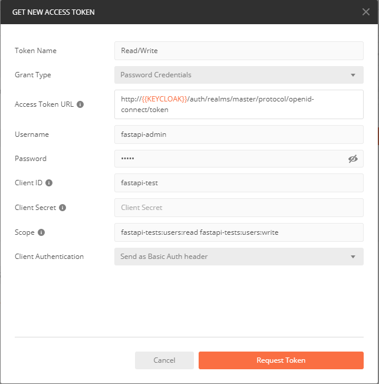

# fastapi-tests
Testing FastAPI endpoints and OAuth 2 `Bearer` token with Keycloak issued JWTs.

## Building and running the container itself
```
$  docker build . -t fastapi-tests:latest

$  docker run -it  --rm -p 8000:8000 fastapi-tests:latest
```

## Using docker-compose to start up OAuth 2 integration
In order to use Keycloak as _Authorization Server_ you can use `docker-compose` to manage all required containers. Remember to build the `fastapi-tests` container first.

```
$ docker-compose up
...
$ docker-compose down
```

## Prepare Keycloak
- [ ] TODO: describe first time setup in keycloak

## Using the application
Once the `docker-compose` is up and running just
- point your browser to [http://localhost:8080](http://localhost:8080) to be redirected to Swagger API documentation
- and use Postman on the URIs that you see

This assumes that you created an _Environment_ in Postman with
- `FASTAPI_APP` pointing to you fastapi URL (e.g. `http://localhost:8080`)
- `KEYCLOAK` pointing to your instance URL (e.g. `http://localhost:8081`)


### Acquiring a read/write
In Postman's _OAuth 2.0_ form click _Get New Access Token_ and

- use _Password Credentials_
- use the `fastapi-test` client just created
- use the `fastapi-admin` user and secret just created
- request the scopes `fastapi-tests:users:write fastapi-tests:users:read`



You can of course check the token at [http://jwt.io](http://jwt.io)

### Add user
In Postman, create
- `POST` request to `http://{{FASTAPI_APP}}/users/`
- have the _Body_ contain _raw_
  ```json
  {"name": "test", "joined": "2020-07-27T11:00:11"}
  ```
- have _Authorization_  use _OAuth 2.0_ with a token that has the `fastapi-tests:users:write` token

### Listing all users
In Postman, create
- `GET` request to `http://{{FASTAPI_APP}}/users`
- have _Authorization_  use _OAuth 2.0_ with a token that has the `fastapi-tests:users:read` token
